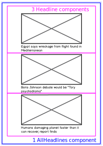
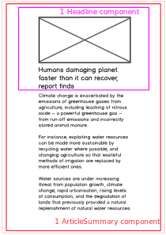

## COMPONENTS HIERARCHY

### There will be 3 components:
Standard:
- Headline
- AllHeadlines
  
Extended:
- ArticleSummary

- Whilst not included on the wireframe, a Header component was added for a better UI
- Due to difficulties with the Router, the ArticleSummary component has been omitted.

## TESTS

## AllHeadlines

1. All of the headlines render
2. The `Headline` component should render with the correct headline text.
3. The `Headline` component should render with the correct image that corresponds to the headline text.
4. There should be a loading message to the users to let them know that the API data is loading before the data renders.
5. There should be an error message if the API fails